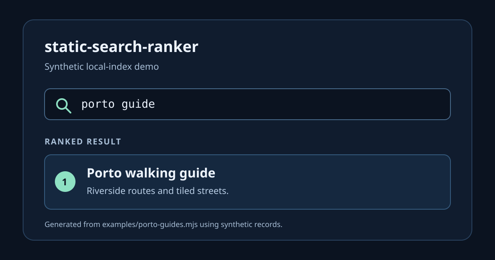

# static-search-ranker

A small, dependency-free TypeScript ranker for static search indexes where the
scoring policy and ordering rules should be visible in code.



`static-search-ranker` turns an array of records plus a declarative field policy
into deterministic ranked results. It is useful for a documentation site,
catalog, help center, or other local index that does not need a server search
service.

```bash
npm install static-search-ranker
```

```ts
import { rank, type RankerPolicy } from 'static-search-ranker';

type Guide = { id: string; title: string; summary: string };

const guides: Guide[] = [
  { id: 'porto', title: 'Porto walking guide', summary: 'Riverside routes and tiled streets.' },
  { id: 'cafe', title: 'Cafés in Porto', summary: 'Coffee and pastries near the river.' },
  { id: 'portland', title: 'Portland guide', summary: 'A guide to a different city.' },
];

const policy: RankerPolicy<Guide> = {
  fields: [
    { name: 'title', getValue: (guide) => guide.title, weights: { exact: 100, prefix: 60, token: 40, includes: 20 } },
    { name: 'summary', getValue: (guide) => guide.summary, weights: { exact: 20, prefix: 12, token: 8, includes: 4 } },
  ],
  stopwords: ['the', 'and'],
  tieBreaker: (guide) => guide.id,
};

const results = rank(guides, 'porto guide', policy, {
  now: Date.parse('2026-01-01T00:00:00Z'),
  limit: 5,
});

console.log(results.map(({ document, score }) => ({ id: document.id, score })));
```

The package exports `rank`, `createRanker`, `normalizeText`, `tokenize`, and
`scoreRecency`, plus its public TypeScript types. See
[the synthetic runnable example](examples/porto-guides.mjs) for the complete
example and its checked output.

For time-based policies, `scoreRecency(timestamp, now, bands)` assigns the
score from the first matching inclusive age band; invalid timestamps produce
zero. A policy can instead set `recency: { getTimestamp, bands }`, which uses
the single `now` value passed to `rank`.

## Why use it

- **Policy is explicit.** Fields, weights, stopwords, filters, boosts, recency
  bands, and tie-breaking live in a plain object.
- **Ordering is predictable.** Supply a stable tie-breaker; results do not rely
  on runtime locale collation or an implicit current clock.
- **Small and local.** The package has no runtime dependencies and ranks the
  documents already in memory.

## Behavior and limits

The default normalizer folds combining marks, lowercases text, changes `&` to
`and`, and uses an ASCII-oriented token model. It is not a stemming, fuzzy,
synonym, or full locale-aware search engine. Provide a custom normalizer or
search service when those semantics are required.

Search quality depends on the policy and the indexed text you supply. A
`RankerPolicy` is intentionally application-owned: this package does not infer
business intent, routing, permissions, or result presentation. Pass `now` when
using time-based ranking so the result can be reproduced in tests.

The initial release supports Node.js 20 or newer and ESM consumers. Browser
bundlers that support standard ESM can use the package; its source does not
access browser globals.

## Development

```bash
npm ci
npm test
npm run build
node examples/porto-guides.mjs
```

The example imports the built package, so it exercises the published export
shape rather than a sibling source file. CI also packs the distribution and
runs that same example from a clean install.

## Origin and history

This package was extracted from the site-search scoring work in
[Gale Finance](https://gale.finance/). Gale-specific search documents, routing,
locale handling, finance intent rules, and content remain in Gale. Until Gale's
cutover is complete, this repository describes the package as “extracted from
Gale”; it does not claim that Gale already uses the published package.

Early commits reconstruct a milestone developed in the private Gale Finance
monorepo. Author dates reflect the original work; public content and hashes were
rewritten to exclude private details. Some early development used Claude as a
coding assistant; Sid Kalla selected, reviewed and maintains this code.

The Apache-2.0 license covers this code. It does not grant rights to Gale
Finance’s logos or visual identity.

## Contributing and security

Contributions are welcome under Apache-2.0; see
[CONTRIBUTING.md](CONTRIBUTING.md). Please report vulnerabilities privately as
described in [SECURITY.md](SECURITY.md). For adoption notes, including an
integration and rollback recipe, see [AGENT_INTEGRATION.md](AGENT_INTEGRATION.md).

Maintenance is best effort. The latest released version is supported unless a
release note says otherwise.
